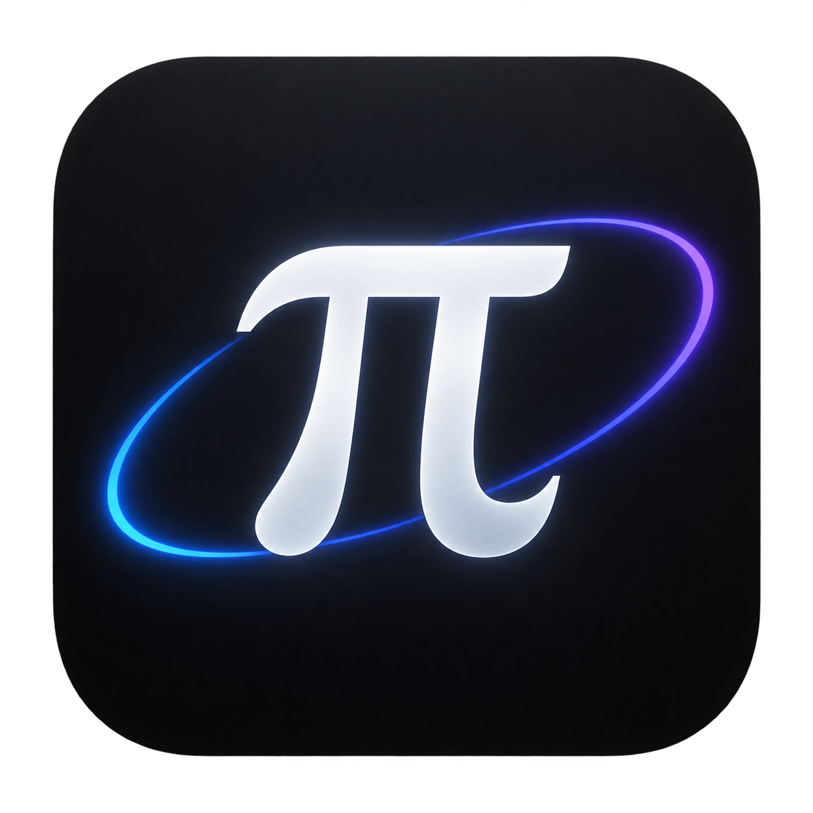

# Pi Halo · 星环

一款以 **pi 核心 agent** 为引擎的桌面可视化终端。pi 的一切规则原样保留 —— 扩展、技能、提示模板、AGENTS.md 上下文、会话树、消息队列（steer / follow-up）、压缩 —— 全部按 pi 自己的方式发现与加载；区别在于：你第一次能**看见** agent 在做什么。



## 亮点

**黑白双色主题（墨 × 纸）**
极简单色设计：默认「墨」· 深黑底白墨水，右上角 ☀ 一键切到「纸」· 纸白底黑墨水；偏好自动记忆，启动无闪色。启动动画、工具卡片全套同步单色化，仅保留绿 ✓ / 红 ✕ 等语义色。

**高端启动动画**
黑色幕布上星尘从四方螺旋汇聚 → π 光环描边成形 → 双重冲击波扩散 → "PI HALO" 字标逐字浮现。期间 agent 核心已并行预热，动画结束即就绪。

**三区布局（参考 MiniMax Design）**
- 左栏：对话状态（呼吸光球实时反映 agent 忙闲）、会话历史、技能/模板/扩展清单、模型卡片
- 中栏：双标签页 —— **工作区**（项目文件树 + 会话改动追踪 + Diff 查看器）、**预览**（HTML/图片/Markdown 实时渲染，agent 生成页面时自动弹出）
- 右栏：流式对话面板 —— 思考过程展开流式滚动、工具调用卡片（spinner→✓/✕、diff 高亮、耗时）、引导/追加队列芯片、token 与费用统计
- 主题：`halo-theme`（localStorage，`dark` / `light`），标题栏 ☀/☾ 按钮或代码内 `applyTheme()` 切换

**多账户登录与额度切换（订阅登录旁的新能力）**
登录配置里每个供应商可保存多个登录身份（OAuth 订阅 / API Key 均可）：每次订阅登录成功自动存为一个账户，也可用「存为账户」手动保存当前身份；账户以芯片形式列在供应商下方，**每个芯片实时显示该账户的剩余额度**（订阅制 5h/7d 百分比、余额制金额、积分制分数，登录配置打开时自动拉取），**点击芯片即一键切换使用哪个账户的额度**（写回与 pi CLI 共享的 `~/.pi/agent/auth.json`，切换完成立即拉取新账户额度并同步模型快照，底部额度条与模型列表随之更新）。登出后账户仍保留在保管库中，随时可切回，无需重新走 OAuth。双击芯片可重命名，× 两次确认删除。保管库文件：`~/.pi/agent/halo-accounts.json`（与 auth.json 同目录、同等敏感，请勿外传）。

**工作区与预览**
- 工作区：实时项目文件树（忽略 node_modules/.git 等，含文件大小），agent 写入/编辑的文件自动高亮并进入“本次会话改动”列表，点击可查看全文或 diff
- 预览：通过本地 `halo-preview://` 协议安全渲染项目内文件；agent 生成 `.html` 时自动切换到预览页；支持在系统编辑器中打开

**多会话并发执行**
每个会话拥有独立的 agent 运行时（会话池，上限 6 个）：**任务执行中随时可以切换会话或新建会话去执行其他任务，切走的任务在后台继续跑**，不会因切换而中止。左侧会话列表带绿色脉冲徽标实时标注“执行中”的会话；切回后历史与结果完整保留。执行中的会话不可删除（需先 Esc 中止），池满时自动淘汰最久未用且空闲的会话。

**交互丝滑**
全部动画基于 `cubic-bezier` 弹性曲线：面板级联入场、消息浮升、按钮悬停抬升、发送键任务中渐变为中止键、玻璃拟态模态框。

## 运行

```bash
npm install        # 安装 electron（二进制需可访问 npm 镜像）
npm start
```

内置引擎直接复用全局安装的 `@earendil-works/pi-coding-agent`（ESM 动态 import），认证、模型、技能、扩展与 `pi` CLI 完全共享（`~/.pi/agent/`）。未配置 API Key 时按 pi 的规则回退，选择模型后即可对话。

> 网络提示：部分供应商（如 openai-codex）需要代理才能访问。`npm start` 会自动注入 `NODE_USE_ENV_PROXY=1`，使 Electron 内置 fetch 遵循你终端里的 `HTTP(S)_PROXY` 环境变量（与 pi CLI 行为一致）；若仍报 `fetch failed`，请确认终端已设置代理环境变量或开启系统代理。pi 的传输策略可通过 `~/.pi/agent/settings.json` 的 `transport`（`sse` / `websocket` / `auto`）调整。

> 平台说明：当前以 Windows 为主平台（内置终端依赖 cmd.exe / GBK / taskkill）；macOS / Linux 可启动但内置终端与部分路径逻辑未适配。

## 安全与配置

- **沙箱与 CSP**：渲染层 `sandbox: true` + Content-Security-Policy（仅本地脚本、`halo-preview:` 框架/图片、`data:` 图片），外链只放行 `https://`。
- **命令注入防护**：`pi install/remove/update` 的包源参数经严格白名单校验（无空格/无 shell 元字符），且不再经 `shell: true` 执行。
- **凭据加密**：多账户保管库 `~/.pi/agent/halo-accounts.json` 的令牌通过 Electron `safeStorage`（Windows DPAPI / macOS Keychain）加密落盘；不可用时自动回退明文（与 auth.json 同级）。
- **环境变量**：`HALO_AUTOCLAW_APP_ID` / `HALO_AUTOCLAW_APP_KEY` 可覆盖 AutoClaw 控制台签名密钥（也支持在设置里写 `autoclawAppId/autoclawAppKey`）；`halo.toasts=all`（localStorage）可恢复全部操作提示（错误/警告提示默认始终显示）。

## 测试

```bash
npm run check          # 全量语法检查（node --check 遍历 src/scripts/test）
npm run lint           # eslint 静态检查
npm run test:inject    # 预览注入脚本语法（离线）
npm run test:render    # 注入模拟 pi 事件流 + DOM 断言 + 截图（test/e2e/）
node test/e2e/verify-stream-render.mjs  # 流式 markdown 增量渲染与全量渲染等价性
npm run test:treewatch # 文件树 watcher：外部改动自动刷新
npm run test:multisession    # 多会话并发：A 后台执行中切 B 发任务，验证不中断 + 徽标 + 切换保留（真实模型）
npm run test:multisession-ui # 多会话 UI 级：执行中新建会话、running 徽标、切回后结果渲染（真实模型）
npm run test:reallink  # 真实链路：真实 prompt → IPC → 实时渲染（需已登录模型）
npm run test:workspace # 真实链路：agent 创建页面 → 自动预览 + 文件树 + 改动标记
```

- `test/e2e/`：维护中的端到端/单元验证套件（npm scripts 入口）
- `test/tools/`：历史探针与一次性调试脚本（`verify-*` / `shot-*` / `dbg-*` 等）
- 截图输出到 `test/shot-*.png`；CI（GitHub Actions）自动跑 check + lint + 注入脚本验证

## 打包

```bash
npm run dist       # 产出 NSIS 安装器（dist/Pi Halo Setup 1.0.0.exe）
npm run dist:dir   # 仅产出免安装目录（dist/win-unpacked/），快速验证
```

打包后的应用通过 `%APPDATA%\npm\node_modules\@earendil-works\pi-coding-agent` 复用全局 pi SDK（与开发模式一致），也可用 `PI_HALO_PI_PATH` 环境变量显式指定 SDK 入口。

## 快捷键

### 项目终端

预览栏右上角的终端按钮可打开或隐藏控制台。每个项目支持最多 8 个独立 CMD 终端，所有项目合计最多 24 个；通过「＋」新建、标签切换、「◫」平铺多个终端。隐藏控制台或切换项目时进程继续运行，标签上的「×」会结束该终端及其子进程。退出应用后终端不保留。

终端使用 Windows ConPTY，支持方向键编辑、命令历史、Tab 补全和 Ctrl+C 中断。Ctrl+Shift+C 复制选中内容，Ctrl+Shift+V 粘贴；输入 `cls` 清屏。输出采用批量传输和背压控制，回滚历史限制为 5000 行。

运行 `npm run test:terminals` 可验证多终端隔离、分屏、隐藏恢复、大量输出和 Ctrl+C。

| 按键 | 作用 |
|------|------|
| `Enter` | 发送 / 运行中插入引导（steer） |
| `Alt+Enter` | 排队追加（follow-up） |
| `Shift+Enter` | 换行 |
| `Esc` | 中止当前任务 / 关闭弹层 |
| `/new` `/model` `/thinking` `/compact` `/help` | 内置命令；其余 `/` 命令与 `/skill:name` 由 pi 引擎原生处理 |
| 拖拽 / 粘贴图片 | 附加到输入框 |

## 架构

```
src/
  main/main.mjs        Electron 主进程：启动动画调度、窗口、IPC 路由、文件树 watcher
  main/pi-bridge.mjs   pi SDK 桥接：createAgentSessionRuntime 完整规则内嵌、多账户凭据库（safeStorage 加密）
  main/inject/         预览帧注入脚本（触摸模拟 / 滚动条美化，独立文件便于 lint）
  preload/preload.cjs  contextBridge 受控 API
  renderer/            三栏 UI（原生 HTML/CSS/JS，零框架依赖）
    js/theme.js       首帧前主题绘制（防闪色）
    js/markdown.js    markdown-lite 渲染 / 语法高亮 / 流式增量渲染
    js/app.js          pi 事件流 → UI 映射
    splash.html/css/js 启动动画
```

无打包步骤、无 UI 框架 —— 主进程与 pi 同进程直连（SDK 模式），事件零拷贝转发。

### Windows 原生模块与打包验证

Windows x64 包使用 node-pty 自带的 Node-API 预编译模块（保留 asarUnpack），关闭 electron-builder 的重复编译，避免 SSH 可选 CPU 检测模块要求本机安装 Visual Studio。升级原生依赖后应重新验证打包产物：

```powershell
npm run dist:dir
$env:HALO_TEST_EXECUTABLE = "dist/win-unpacked/Pi Halo.exe"
node test/e2e/e2e-terminals.mjs
Remove-Item Env:HALO_TEST_EXECUTABLE
```
