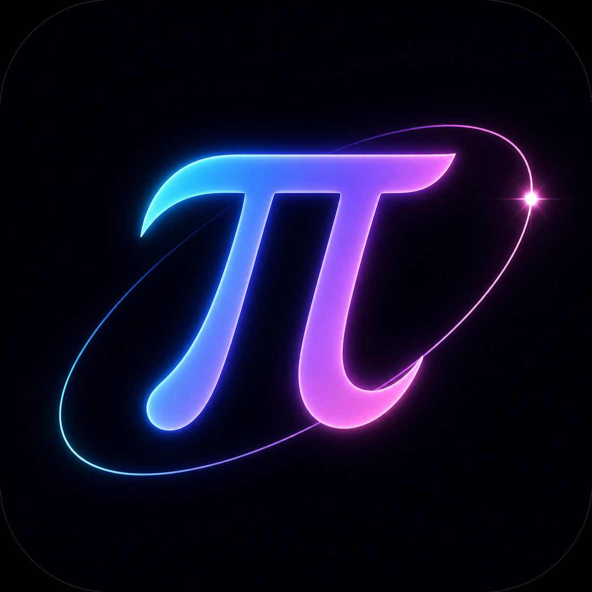

# Pi Halo · 星环

一款以 **pi 核心 agent** 为引擎的桌面可视化终端。pi 的一切规则原样保留 —— 扩展、技能、提示模板、AGENTS.md 上下文、会话树、消息队列（steer / follow-up）、压缩 —— 全部按 pi 自己的方式发现与加载；区别在于：你第一次能**看见** agent 在做什么。



## 亮点

**星环画布（核心差异化设计）**
中央是一片实时运转的星系：π 光核位于中心，每一次工具调用（read / bash / edit / write / grep…）都会化作一颗发光星体进入轨道运转；文件写入时会飞出绿色轨迹标签；任务运行时光核呼吸加速、光晕泛紫。任务历史像行星带一样环绕核心，一眼看尽 agent 的全部活动。

**高端启动动画**
黑色幕布上星尘从四方螺旋汇聚 → π 光环描边成形 → 双重冲击波扩散 → "PI HALO" 字标逐字浮现。期间 agent 核心已并行预热，动画结束即就绪。

**三区布局（参考 MiniMax Design）**
- 左栏：对话状态（呼吸光球实时反映 agent 忙闲）、会话历史、技能/模板/扩展清单、模型卡片
- 中栏：三标签页 —— **工作区**（项目文件树 + 会话改动追踪 + Diff 查看器）、**预览**（HTML/图片/Markdown 实时渲染，agent 生成页面时自动弹出）、**星环**（可选的装饰性可视化，工具调用化作绕核运转的星体）
- 右栏：流式对话面板 —— 思考过程展开流式滚动、工具调用卡片（spinner→✓/✕、diff 高亮、耗时）、引导/追加队列芯片、token 与费用统计

**工作区与预览**
- 工作区：实时项目文件树（忽略 node_modules/.git 等，含文件大小），agent 写入/编辑的文件自动高亮并进入“本次会话改动”列表，点击可查看全文或 diff
- 预览：通过本地 `halo-preview://` 协议安全渲染项目内文件；agent 生成 `.html` 时自动切换到预览页；支持在系统编辑器中打开

**交互丝滑**
全部动画基于 `cubic-bezier` 弹性曲线：面板级联入场、消息浮升、按钮悬停抬升、发送键任务中渐变为中止键、玻璃拟态模态框。`Ctrl+滚轮` / 滚轮直接缩放星环。

## 运行

```bash
npm install        # 安装 electron（二进制需可访问 npm 镜像）
npm start
```

内置引擎直接复用全局安装的 `@earendil-works/pi-coding-agent`（ESM 动态 import），认证、模型、技能、扩展与 `pi` CLI 完全共享（`~/.pi/agent/`）。未配置 API Key 时按 pi 的规则回退，选择模型后即可对话。

> 网络提示：部分供应商（如 openai-codex）需要代理才能访问；若错误卡提示网络失败，请检查系统代理。pi 的传输策略可通过 `~/.pi/agent/settings.json` 的 `transport`（`sse` / `websocket` / `auto`）调整。

## 测试

```bash
npm run test:render   # 注入模拟 pi 事件流并截图验证渲染管线
node test/e2e-reallink.mjs    # 真实链路：真实 prompt → IPC → 实时渲染
node test/e2e-workspace.mjs   # 真实链路：agent 创建页面 → 自动预览 + 文件树 + 改动追踪
```

截图输出到 `test/shot-happy.png`（正常流：流式回复 + 工具卡 + 队列芯片）与 `test/shot-error.png`（错误卡 + 自动重试状态）。

## 快捷键

| 按键 | 作用 |
|------|------|
| `Enter` | 发送 / 运行中插入引导（steer） |
| `Alt+Enter` | 排队追加（follow-up） |
| `Shift+Enter` | 换行 |
| `Esc` | 中止当前任务 / 关闭弹层 |
| `/new` `/model` `/thinking` `/compact` `/help` | 内置命令；其余 `/` 命令与 `/skill:name` 由 pi 引擎原生处理 |
| 拖拽 / 粘贴图片 | 附加到输入框 |

## 架构

```
src/
  main/main.mjs        Electron 主进程：启动动画调度、窗口、IPC 路由
  main/pi-bridge.mjs   pi SDK 桥接：createAgentSessionRuntime 完整规则内嵌
  preload/preload.cjs  contextBridge 受控 API
  renderer/            三栏 UI（原生 HTML/CSS/JS，零框架依赖）
    js/nebula.js       星环画布（Canvas 2D 粒子星系）
    js/app.js          pi 事件流 → UI 映射
    splash.html/css/js 启动动画
```

无打包步骤、无 UI 框架 —— 主进程与 pi 同进程直连（SDK 模式），事件零拷贝转发。
